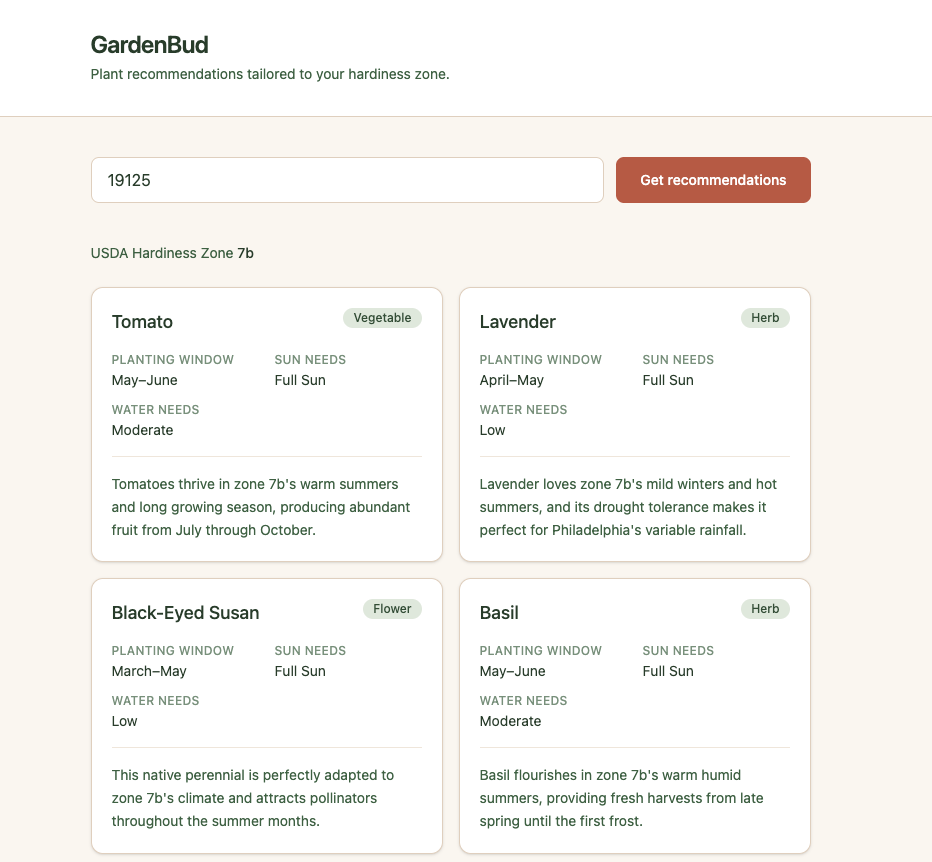

# GardenBud

GardenBud takes a ZIP code, looks up the USDA hardiness zone, and uses the Claude API to return personalized plant recommendations for your garden.



## Stack

- **Frontend** — React, Vite, Tailwind CSS v4
- **Backend** — Node.js, Express
- **APIs** — [phzmapi.org](https://phzmapi.org/) (hardiness zone lookup), [Anthropic Claude API](https://docs.anthropic.com/) (plant recommendations)

## Run locally

### Prerequisites

- Node.js 18+
- An [Anthropic API key](https://console.anthropic.com/)

### 1. Install dependencies

```bash
cd server && npm install
cd ../client && npm install
```

### 2. Configure the server

Create `server/.env` with your API key:

```
ANTHROPIC_API_KEY=your_key_here
```

### 3. Start the backend

In one terminal window, navigate to the `server` directory and start the API:

```bash
cd server
npm run dev
```

The backend runs at `http://localhost:3001`.

### 4. Start the frontend

In a separate terminal window, navigate to the `client` directory and start the dev server:

```bash
cd client
npm run dev
```

### 5. Use the app

Open [http://localhost:5173/](http://localhost:5173/) in your browser, enter a 5-digit ZIP code, and click **Get recommendations**.
